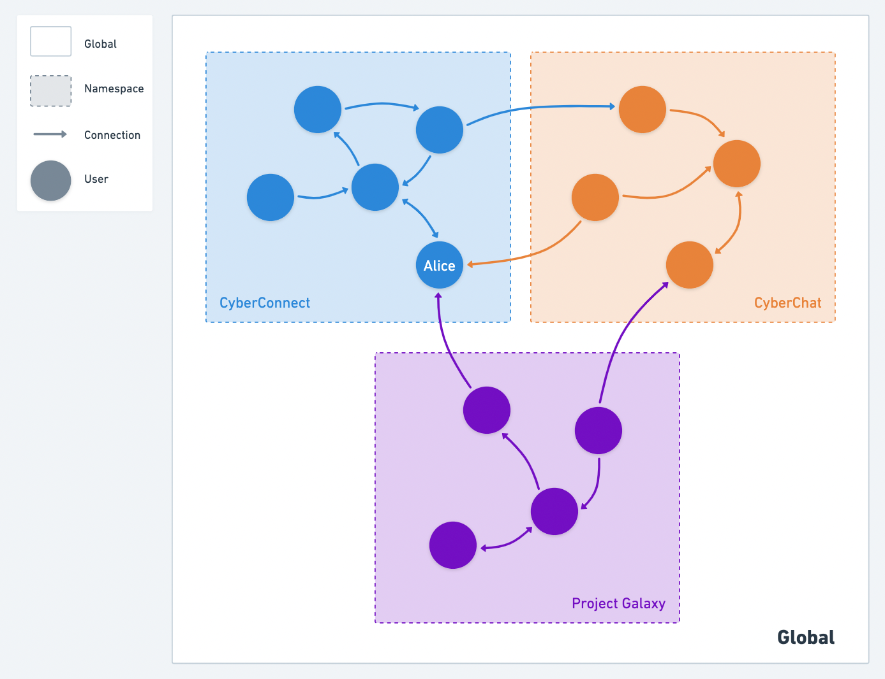

CyberConnect provides `namespace` as an attribute for each connection, to identify the source of the connection. You can set only one `namespace` value for each connection and then filter it with the specified `namespace`.   

When writing a new connection, a customized `namespace` is recommended. We suggest you use a string that can serve as your unique id, such as the name of your application, organization, or platform. If no `namespace` or an empty value of `namespace` is given, the connection will be added to the default namespace: `CyberConnect`.

When querying the follower, following, friend list, or the numbers of them, the results can be filtered by `namepsace`, as an optional parameter. If no `namespace` or an empty value of `namespace` is given, connections in all namespaces will be returned. 

Let's take the scenario in the following picture as an example.

Alice has three followers in total: one in CyberConnect, one in CyberChat, and one in Project Galaxy.

- If we try to write a new connection without specifying the `namespace`,  the connection will be put into `CyberConnect` namespace.
- If we query the follower list of Alice with `CyberChat` as the namespace parameter, we will get one connection (the orange arrow).
- If we query the follower list of Alice without a namespace parameter or set it as an empty string, we will get three connections.

